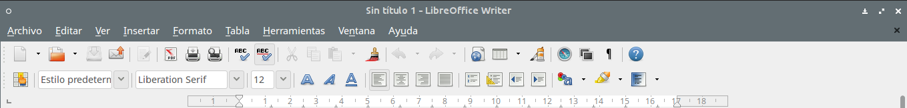
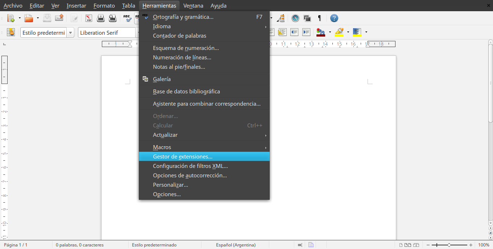
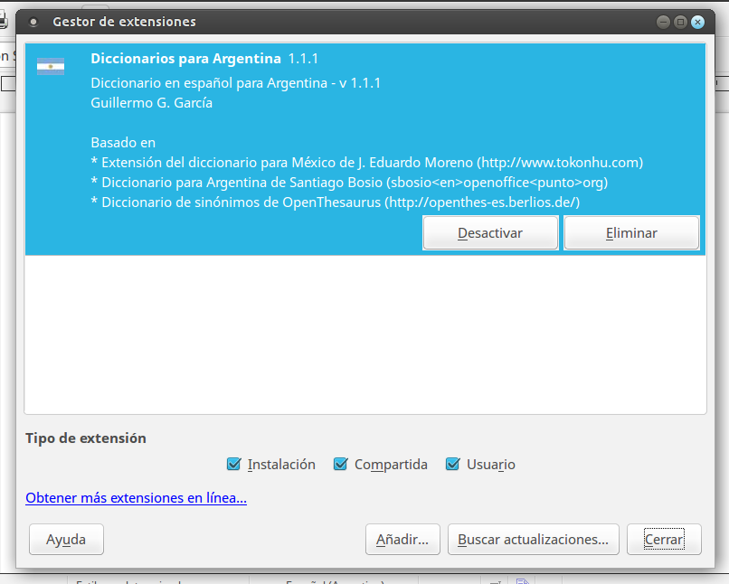
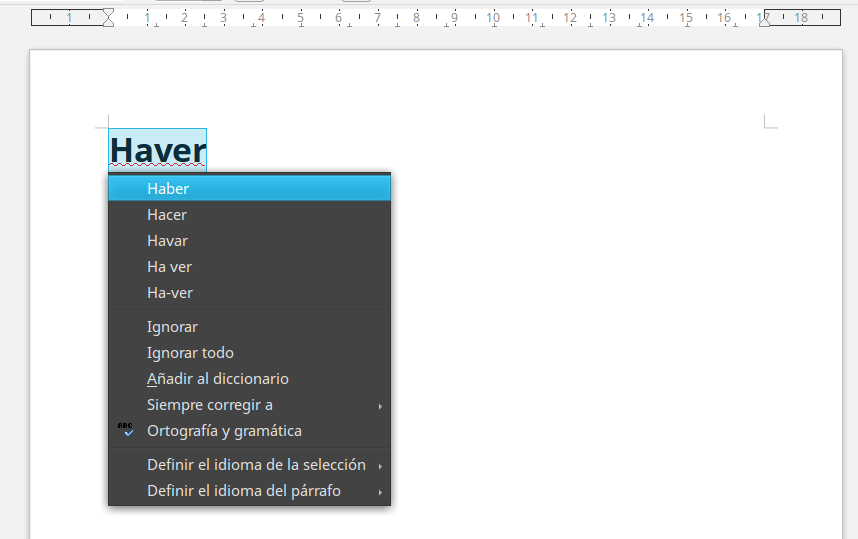
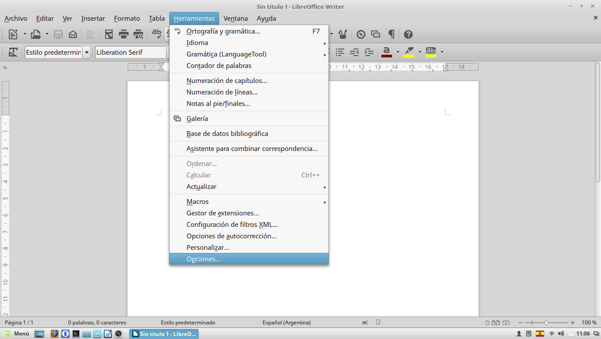
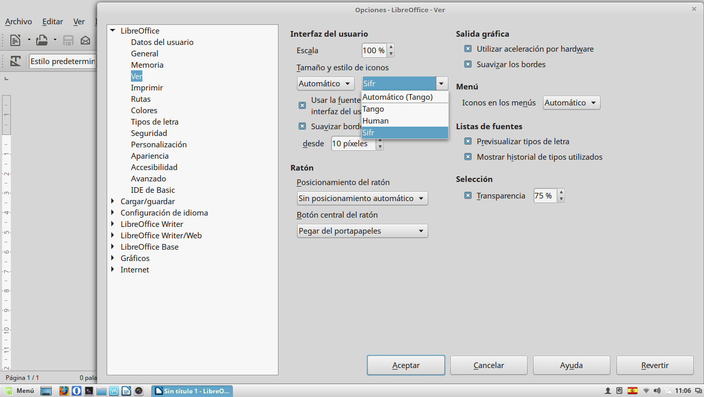

# Configuración de LibreOffice

##### Script para descargar extensiones y configurar LibreOffice en español

- - - -
Básicamente lo que hace este script escrito en bash es ofrecer un menú en el cual podremos elegir:

* Instalar el idioma español base de LibreOffice, esto es pone toda la ofimática en español.
* Instalar los diccionarios en español desde los repositorios que cada distribución **GNU/Linux** tiene. Estos diccionarios también los utilizan otras aplicaciones.
* Instalar extensiones de diccionarios y sinónimos, quizás más completo que el punto anterior. Hay tres extensiones:
	* Diccionario español Argentino v 1.1.1
	* Diccionario español Español y América Latina v 0.5
	* Diccionario español Español v0.6

Son tres extensiones distintas, versiones mejoradas y algunas basadas en otras. Cada extensión pesa entre **1,4 MB y 2 MB**.

Y por último tenes una extensión llamada Language Tool 2.8. Es un diccionarios más completo, con sinónimos y correcciones semánticas. Es mucho más avanzado y pesa unos **50MB**.

* Cómo ultimo punto del menú tenemos la posibilidad de instalar algunos set de iconos para LibreOffice.

## Instalación de extensiones

Debemos ir a **Herramientas > Gestionar extensiones... > Añadir...** y buscamos nuestra extensión, que se ha decargado en nuestro directorio *home* **>** "**$HOME/libreoffice**"

####**Captura Nº 1**

####**Captura Nº 2**

####**Captura Nº 3**

##Configurar iconos

Para seleccionar los iconos debemos ir a **Herramientas > Opciones... > Ver ** y marcamos el set de iconos que más nos guste en "**Tamaño y estilo de iconos**".
####**Captura Nº 1**

####**Captura Nº 2**

- - -